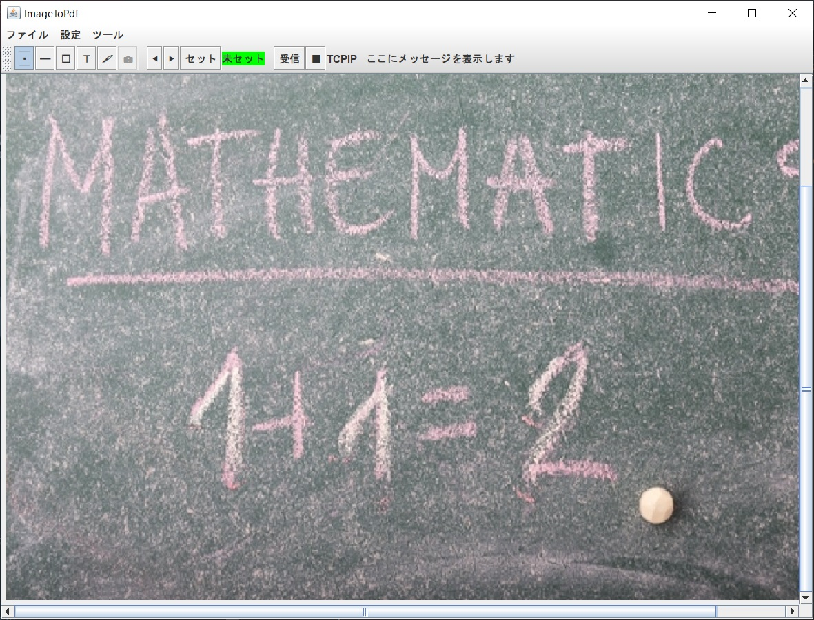
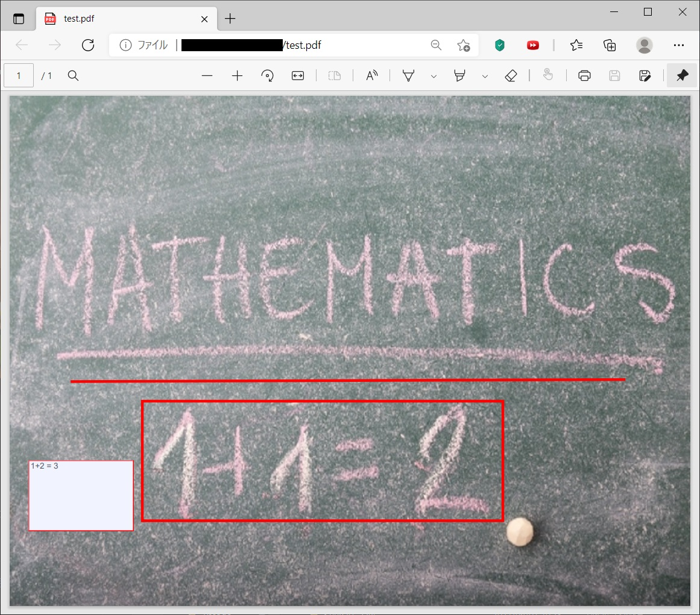

# ImageSender
## 概要
別リポジトリの[ImageSender](https://github.com/HN410/ImageSender)から送信された写真をもとに，PDF
を作成するソフトです．

使用例

画面に直線，矩形，テキストを入力して

PDFに保存することができます

## 使用しているライブラリ
iText7
Swing

## 参考にさせていただいたサイト

https://qiita.com/aoirint/items/d2cebec7a9e8c3680780

http://www.kotemaru.org/2013/10/30/android-bluetooth-sample.html

https://www.mltlab.com/wp/archives/546

https://www.javadrive.jp/tutorial/

https://itextpdf.com/en/products/itext-7/itext-7-core

